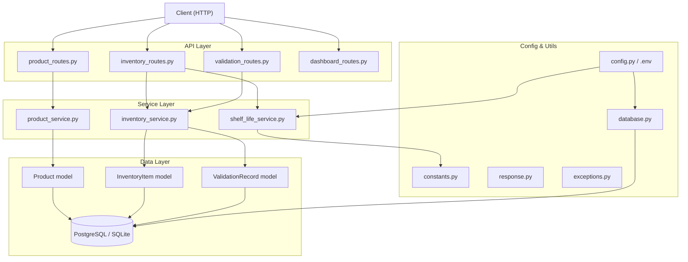
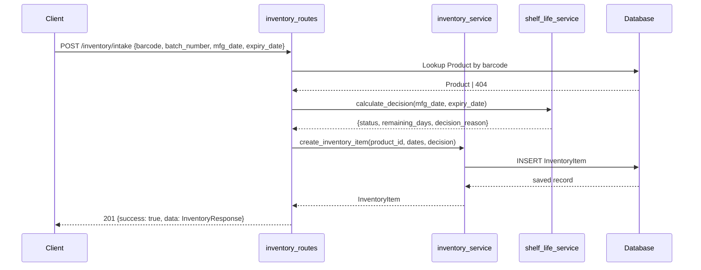
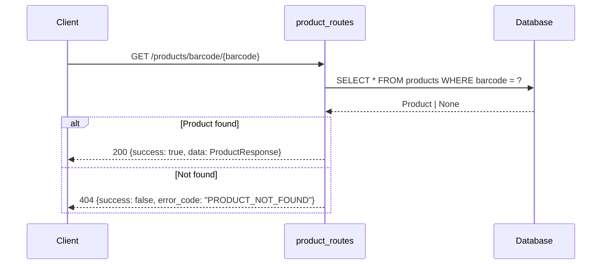
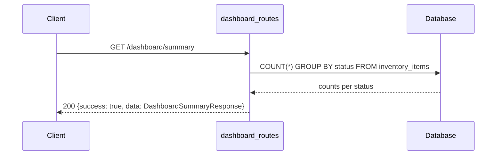

# Design Document: Phase 1A — AI-Powered Expiry Date Validation (Backend Fixes)

## Overview

This phase closes the critical backend gaps that prevent the expiry date validation system from being production-ready. The work is split between two parallel streams: **Member 1** hardens the core infrastructure (settings, database, models, shelf-life decision logic) and **Member 2** builds out all API surface area (schemas, routes, common response format, tests, README). No ML/OCR work is included; any future ML hooks are represented as nullable fields only.

The target stack is **FastAPI + SQLAlchemy + Pydantic** backed by **PostgreSQL** (production) or **SQLite** (local dev), with JWT authentication already present and preserved as-is.

---

## Architecture



---

## Sequence Diagrams

### Inventory Intake Flow



### Barcode Product Lookup



### Dashboard Summary



---

## Components and Interfaces

### config.py

**Purpose**: Centralise all environment-driven settings. Replaces all hardcoded values.

**Interface**:
```python
class Settings(BaseSettings):
    DATABASE_URL: str           # postgresql:// or sqlite:///
    SECRET_KEY: str
    ACCESS_TOKEN_EXPIRE_MINUTES: int = 60
    WARNING_DAYS: int = 60      # threshold: PRIORITY_SALE if remaining_days <= this
    REJECT_DAYS: int = 30       # threshold: REJECTED if remaining_days <= this
    APP_ENV: str = "development"

    class Config:
        env_file = ".env"

settings = Settings()
```

**Responsibilities**:
- Load `.env` at startup
- Expose a single `settings` singleton used by all modules
- Fail fast with a clear error if required variables are missing

---

### database.py

**Purpose**: Provide the SQLAlchemy engine, session factory, declarative base, and the FastAPI dependency `get_db`.

**Interface**:
```python
engine: Engine
SessionLocal: sessionmaker
Base: DeclarativeMeta

def get_db() -> Generator[Session, None, None]: ...
```

**Responsibilities**:
- Read `DATABASE_URL` from `settings` (not hardcoded)
- Support both PostgreSQL and SQLite connection strings
- Expose `Base` so all models can inherit from it

---

### shelf_life_service.py

**Purpose**: Pure decision logic — given dates, return an inventory decision.

**Interface**:
```python
def calculate_decision(
    manufacturing_date: date | None,
    expiry_date: date | None,
    today: date | None = None   # injectable for testing
) -> ShelfLifeResult:
    ...

class ShelfLifeResult(TypedDict):
    status: str           # one of DECISION_STATUSES
    remaining_days: int | None
    decision_reason: str
```

**Decision Rules** (evaluated in order):

| Condition | Status | reason |
|---|---|---|
| `expiry_date` is None | `MANUAL_REVIEW` | "Missing expiry date" |
| `expiry_date < manufacturing_date` | `INVALID_DATE` | "Expiry date precedes manufacturing date" |
| `expiry_date < today` | `REJECTED` | "Product already expired" |
| `remaining_days < REJECT_DAYS` | `REJECTED` | "Expires within reject threshold" |
| `remaining_days <= WARNING_DAYS` | `PRIORITY_SALE` | "Nearing expiry — priority sale" |
| `remaining_days > WARNING_DAYS` | `ACCEPTED` | "Within acceptable shelf life" |

**Responsibilities**:
- Contain zero I/O (pure function)
- Read thresholds from `settings`
- Accept an injectable `today` date for deterministic testing

---

### product_service.py

**Purpose**: Thin service wrapping product DB operations so routes stay thin.

**Interface**:
```python
def get_product_by_id(db: Session, product_id: int) -> Product | None: ...
def get_product_by_barcode(db: Session, barcode: str) -> Product | None: ...
def create_product(db: Session, data: ProductCreate) -> Product: ...
def update_product(db: Session, product_id: int, data: ProductUpdate) -> Product: ...
def list_products(db: Session, skip: int, limit: int) -> list[Product]: ...
```

---

### inventory_service.py

**Purpose**: Orchestrates inventory intake — calls shelf_life_service, persists InventoryItem.

**Interface**:
```python
def intake(db: Session, data: InventoryIntakeRequest) -> InventoryItem: ...
def get_item(db: Session, item_id: int) -> InventoryItem | None: ...
def list_items(db: Session, status: str | None, skip: int, limit: int) -> list[InventoryItem]: ...
def get_dashboard_summary(db: Session) -> DashboardSummaryResponse: ...
```

---

### utils/constants.py

**Purpose**: Single source of truth for all status string literals.

```python
ACCEPTED       = "ACCEPTED"
PRIORITY_SALE  = "PRIORITY_SALE"
REJECTED       = "REJECTED"
MANUAL_REVIEW  = "MANUAL_REVIEW"
INVALID_DATE   = "INVALID_DATE"

DECISION_STATUSES = {ACCEPTED, PRIORITY_SALE, REJECTED, MANUAL_REVIEW, INVALID_DATE}
```

---

### utils/response.py

**Purpose**: Standardised JSON response helpers.

```python
def success_response(data: Any, message: str = "OK") -> dict:
    return {"success": True, "message": message, "data": data}

def error_response(message: str, error_code: str) -> dict:
    return {"success": False, "message": message, "error_code": error_code}
```

---

### utils/exceptions.py

**Purpose**: Custom exception classes used across routes/services.

```python
class ProductNotFoundError(Exception): ...
class DuplicateBarcodeError(Exception): ...
class DuplicateSKUError(Exception): ...
class InventoryItemNotFoundError(Exception): ...
```

---

## Data Models

### Product

```python
class Product(Base):
    __tablename__ = "products"

    id:           int       # PK, auto-increment
    name:         str       # required
    sku:          str       # unique, indexed
    barcode:      str|None  # unique, indexed, nullable
    category:     str|None
    image_url:    str|None  # future ML/OCR placeholder
    created_at:   datetime  # server default = now()
    updated_at:   datetime  # onupdate = now()
```

**Validation Rules**:
- `sku` must be non-empty and unique across the table
- `barcode` must be unique when provided
- `name` must be non-empty

---

### InventoryItem

```python
class InventoryItem(Base):
    __tablename__ = "inventory_items"

    id:               int
    product_id:       int       # FK → products.id, NOT NULL
    batch_number:     str|None
    manufacturing_date: date|None
    expiry_date:      date|None
    remaining_days:   int|None   # computed at intake, stored
    status:           str        # one of DECISION_STATUSES, default "MANUAL_REVIEW"
    decision_reason:  str|None
    created_at:       datetime
    updated_at:       datetime

    product: relationship("Product")
```

**Validation Rules**:
- `product_id` must reference an existing product
- `status` must be one of `DECISION_STATUSES`
- `remaining_days` is `None` when `expiry_date` is `None`

---

### ValidationRecord

```python
class ValidationRecord(Base):
    __tablename__ = "validation_records"

    id:                   int
    inventory_item_id:    int       # FK → inventory_items.id, NOT NULL
    raw_text:             str|None  # OCR raw output placeholder (future ML)
    extracted_mfg_date:   date|None # parsed date placeholder
    extracted_expiry_date: date|None
    confidence_score:     float|None # ML confidence placeholder (0.0–1.0)
    validation_status:    str        # e.g. "manual", "ocr_pending"
    failure_reason:       str|None
    created_at:           datetime

    inventory_item: relationship("InventoryItem")
```

**Note**: ML/OCR fields (`raw_text`, `confidence_score`) are nullable placeholders only. No ML logic is implemented in Phase 1A.

---

## Pydantic Schemas

### Product Schemas

```python
class ProductCreate(BaseModel):
    name: str
    sku: str
    barcode: str | None = None
    category: str | None = None
    image_url: str | None = None

class ProductUpdate(BaseModel):
    name: str | None = None
    category: str | None = None
    barcode: str | None = None
    image_url: str | None = None

class ProductResponse(ProductCreate):
    id: int
    created_at: datetime
    updated_at: datetime
    model_config = ConfigDict(from_attributes=True)
```

### Inventory Schemas

```python
class InventoryIntakeRequest(BaseModel):
    barcode: str                      # used to resolve product_id
    batch_number: str | None = None
    manufacturing_date: date | None = None
    expiry_date: date | None = None

class InventoryResponse(BaseModel):
    id: int
    product_id: int
    batch_number: str | None
    manufacturing_date: date | None
    expiry_date: date | None
    remaining_days: int | None
    status: str
    decision_reason: str | None
    created_at: datetime
    updated_at: datetime
    model_config = ConfigDict(from_attributes=True)
```

### Validation Schemas

```python
class ValidationManualCreate(BaseModel):
    inventory_item_id: int
    extracted_mfg_date: date | None = None
    extracted_expiry_date: date | None = None
    failure_reason: str | None = None

class ValidationResponse(BaseModel):
    id: int
    inventory_item_id: int
    raw_text: str | None
    extracted_mfg_date: date | None
    extracted_expiry_date: date | None
    confidence_score: float | None
    validation_status: str
    failure_reason: str | None
    created_at: datetime
    model_config = ConfigDict(from_attributes=True)
```

### Common Response Schemas

```python
class SuccessResponse(BaseModel, Generic[T]):
    success: bool = True
    message: str = "OK"
    data: T

class ErrorResponse(BaseModel):
    success: bool = False
    message: str
    error_code: str

class DashboardSummaryResponse(BaseModel):
    total: int
    accepted: int
    priority_sale: int
    rejected: int
    manual_review: int
    invalid_date: int
```

---

## API Routes

### Product Routes (`/products`)

| Method | Path | Description |
|--------|------|-------------|
| POST | `/products` | Create a new product |
| GET | `/products` | List all products (paginated) |
| GET | `/products/{id}` | Get product by ID |
| GET | `/products/barcode/{barcode}` | Lookup product by barcode |
| PUT | `/products/{id}` | Update product fields |

### Inventory Routes (`/inventory`)

| Method | Path | Description |
|--------|------|-------------|
| POST | `/inventory/intake` | Intake a batch — triggers shelf-life decision |
| GET | `/inventory` | List all inventory items (paginated) |
| GET | `/inventory/{id}` | Get a single inventory item |
| GET | `/inventory/accepted` | Filter by ACCEPTED status |
| GET | `/inventory/priority-sale` | Filter by PRIORITY_SALE status |
| GET | `/inventory/rejected` | Filter by REJECTED status |
| GET | `/inventory/manual-review` | Filter by MANUAL_REVIEW status |

### Validation Routes (`/validation`)

| Method | Path | Description |
|--------|------|-------------|
| POST | `/validation/manual` | Create a manual validation record |
| GET | `/validation/{inventory_item_id}` | Get validation records for an item |

### Dashboard Routes (`/dashboard`)

| Method | Path | Description |
|--------|------|-------------|
| GET | `/dashboard/summary` | Returns counts per decision status |

---

## Error Handling

### Error Scenario 1: Product Not Found (barcode lookup)

**Condition**: `GET /products/barcode/{barcode}` where barcode does not exist in DB
**Response**: `404` with `{"success": false, "error_code": "PRODUCT_NOT_FOUND"}`
**Recovery**: Caller should create the product first via `POST /products`

### Error Scenario 2: Duplicate Barcode / SKU

**Condition**: `POST /products` with a barcode or SKU already registered
**Response**: `409 Conflict` with `{"success": false, "error_code": "DUPLICATE_BARCODE"}` or `"DUPLICATE_SKU"`
**Recovery**: Caller should look up the existing product and update if needed

### Error Scenario 3: Invalid Date Logic (intake)

**Condition**: `expiry_date < manufacturing_date` submitted via intake
**Response**: `201` with `status: "INVALID_DATE"` — not an HTTP error; the record is persisted for audit
**Recovery**: Warehouse staff manually reviews the item

### Error Scenario 4: Missing Expiry Date

**Condition**: `expiry_date` is null on intake
**Response**: `201` with `status: "MANUAL_REVIEW"` — persisted for human review
**Recovery**: A ValidationRecord is created and staff resolves manually

### Error Scenario 5: Database Unavailable

**Condition**: Connection to PostgreSQL fails at startup or request time
**Response**: `500` with `{"success": false, "error_code": "DB_UNAVAILABLE"}`
**Recovery**: `get_db` dependency raises; FastAPI 500 handler catches and formats

---

## Testing Strategy

### Unit Testing Approach

All business logic in `shelf_life_service.py` is covered by unit tests with injected `today` dates:
- ACCEPTED path: remaining > WARNING_DAYS
- PRIORITY_SALE path: REJECT_DAYS < remaining <= WARNING_DAYS
- REJECTED path (expired): expiry_date < today
- REJECTED path (threshold): remaining_days < REJECT_DAYS
- MANUAL_REVIEW path: expiry_date is None
- INVALID_DATE path: expiry_date < manufacturing_date

### Integration Testing Approach

Route-level tests using `TestClient` with an in-memory SQLite database:
- Product creation — success
- Duplicate barcode rejection — 409 expected
- Duplicate SKU rejection — 409 expected
- Barcode lookup — success and 404
- Inventory intake — all 5 decision outcomes
- Dashboard summary counts — totals match inserted records

### Property-Based Testing Approach

Not required for Phase 1A. The deterministic decision table in `shelf_life_service` is exhaustively testable via examples.

---

## Gap Analysis (Current vs Target State)

| Area | Current State | Gap | Phase 1A Fix |
|------|--------------|-----|-------------|
| Settings | Hardcoded in `auth.py`, `database.py` | No `.env` support | `config.py` + `Settings` class |
| Database URL | Hardcoded PostgreSQL string | Dev needs SQLite | Read from `settings.DATABASE_URL` |
| `database.py` location | `app/config/database.py` | Target is `app/database.py` | Relocate and update imports |
| Product model | Missing `created_at`, `updated_at` | Audit trail incomplete | Add timestamp columns |
| InventoryItem model | Missing `remaining_days`, `status` named differently | Decision result not stored | Add fields, rename `current_status` → `status` |
| ValidationRecord model | Does not exist | Cannot log validation events | Create new model |
| Shelf life logic | None | Core business logic missing | Implement `shelf_life_service.py` |
| Response format | Inconsistent (raw Pydantic returns) | No standard envelope | `response.py` helpers + `SuccessResponse` |
| Barcode lookup route | Missing | Client cannot resolve barcode | Add `GET /products/barcode/{barcode}` |
| Status filter routes | Missing | Cannot filter inventory by decision | Add `/inventory/accepted`, etc. |
| Validation routes | Missing | No manual review workflow | Add `/validation/*` |
| Dashboard route | Missing | No summary view | Add `/dashboard/summary` |
| Auth service hardcoded secrets | `SECRET_KEY` hardcoded in `auth.py` | Security risk | Move to `settings` |
| Tests | None | No quality gate | `tests/` directory with test suite |
| `utils/constants.py` | Missing | Magic strings scattered | Create with all status literals |

---

## Security Considerations

- `SECRET_KEY` must be loaded from `.env`, never committed to source control
- `.env.example` documents all required vars with safe placeholder values
- JWT auth is already present and applies to inventory routes; product routes should decide per-team whether to require auth
- Barcode is a unique index — a timing-based enumeration attack is theoretically possible but is not a concern for an internal warehouse tool
- All DB queries use SQLAlchemy ORM parameterisation — no raw string interpolation

---

## Performance Considerations

- `barcode` and `sku` are indexed on the `products` table — lookups are O(log n)
- `status` should be indexed on `inventory_items` to support the filtered list routes efficiently
- Dashboard summary uses a single aggregation query (`GROUP BY status`) rather than N queries
- Pagination (`skip`/`limit`) is applied on all list endpoints

---

## Correctness Properties

These invariants must hold at all times and are directly testable via unit and integration tests.

### Property 1: Shelf-life decision completeness

For every combination of `(manufacturing_date, expiry_date)`, `calculate_decision` returns exactly one status from `DECISION_STATUSES`. There is no input for which the function raises an unhandled exception or returns `None`.

### Property 2: Decision exclusivity

The decision rules are evaluated in strict priority order. No inventory item can ever have more than one status simultaneously.

### Property 3: INVALID_DATE soundness

If `status == INVALID_DATE` then `expiry_date < manufacturing_date` (when both are non-null).

### Property 4: MANUAL_REVIEW completeness

If `expiry_date is None` then `status == MANUAL_REVIEW`.

### Property 5: REJECTED soundness

If `status == REJECTED` then either `expiry_date < today` OR `remaining_days < REJECT_DAYS`.

### Property 6: PRIORITY_SALE soundness

If `status == PRIORITY_SALE` then `REJECT_DAYS <= remaining_days <= WARNING_DAYS`.

### Property 7: ACCEPTED soundness

If `status == ACCEPTED` then `remaining_days > WARNING_DAYS`.

### Property 8: Barcode uniqueness

No two `Product` rows share the same non-null barcode. Enforced at both the database level (unique index) and service level (409 before insert).

### Property 9: SKU uniqueness

No two `Product` rows share the same SKU. Same dual enforcement.

### Property 10: Dashboard consistency

`summary.total == summary.accepted + summary.priority_sale + summary.rejected + summary.manual_review + summary.invalid_date` at any point in time.

### Property 11: `remaining_days` fidelity

For any stored `InventoryItem` where `expiry_date` is not null, `remaining_days` equals `(expiry_date − intake_date).days` as computed at intake time.

---

## Dependencies

| Package | Purpose |
|---------|---------|
| `fastapi` | Web framework |
| `uvicorn` | ASGI server |
| `sqlalchemy` | ORM |
| `pydantic[email]` | Schema validation |
| `pydantic-settings` | `.env` loading via `BaseSettings` |
| `python-jose[cryptography]` | JWT |
| `passlib[bcrypt]` | Password hashing |
| `python-dotenv` | `.env` loading fallback |
| `psycopg2-binary` | PostgreSQL driver |
| `pytest` | Test runner |
| `httpx` | `TestClient` async support |
| `pytest-asyncio` | Async test support |
